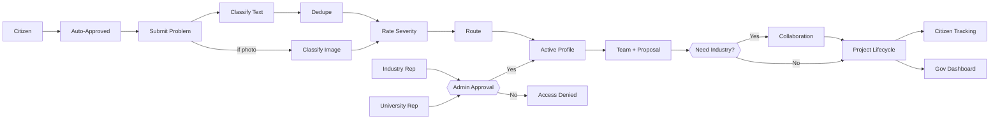

# Setu

**A digital platform to crowdsource societal challenges and facilitate collaborative problem solving through universities and industry partnerships.**

Built for Smart India Hackathon 2026 — Problem Statement SIH26043 (Theme: Smart Education) — by **Team Code Crusaders**.

Setu ("bridge" in Hindi) connects everyday civic problems reported by citizens with the university researchers and industry partners who can actually solve them — tracked transparently from report to resolution.

---

## What it does

1. A citizen submits a problem — text description, an optional photo, and a location.
2. The system classifies the problem's category from the text, cross-checks it against the photo, deduplicates it against existing reports, and scores its severity.
3. It's automatically routed to the university whose domain expertise matches the category.
4. Faculty and students form a team, propose a solution, and optionally bring in industry/CSR partners for funding or mentorship.
5. The citizen tracks progress the whole way; a government dashboard aggregates trends across every submission.

University and industry accounts require admin approval before activation — citizens get instant access.

---

## Tech stack

| Layer | Technology |
|---|---|
| Frontend | React (Vite) + Tailwind CSS |
| Backend | Supabase — Postgres, Auth, Storage, Edge Functions |
| AI — text classification | Fine-tuned Hugging Face model (zero-shot baseline for MVP) |
| AI — image classification | CLIP (zero-shot), for cross-verifying photo evidence |
| AI — severity scoring | LLM API (Gemini free tier) |
| Deduplication | Vector similarity search (pgvector) |
| Analytics | Recharts |
| i18n | react-i18next — English, Hindi, Hinglish |

---

## Pipeline



Only the severity-rating step uses genuine LLM judgment. Classification, deduplication, and routing are deterministic — reliable, auditable, and cheap to run at scale.

---

## Getting started

### 1. Clone and install

```bash
git clone <your-repo-url>
cd setu
npm install
```

### 2. Set up Supabase

- Create a free project at [supabase.com](https://supabase.com).
- Run the schema, RLS policies, and grants from `docs/schema.sql` (or your SQL editor history) to create `profiles`, `universities`, `problems`, and `updates`.
- Enable the `pgvector` extension if using embedding-based deduplication.
- Deploy the `categorize-problem` Edge Function (`supabase functions deploy categorize-problem`) and set your `HF_TOKEN` secret.

### 3. Configure environment variables

Copy `.env.example` to `.env` and fill in your project's values:

```
VITE_SUPABASE_URL=your_project_url
VITE_SUPABASE_PUBLISHABLE_KEY=your_publishable_key
```

### 4. Run locally

```bash
npm run dev
```

Opens on `localhost:5173`, connected live to your Supabase project — no deployment needed for local testing or a demo.

---

## Project structure

```
src/
  context/        Theme (dark/light) and Auth providers
  components/     Navbar, LanguageSwitcher, ProtectedRoute, StatusBadge
  pages/          Landing, Login, Signup, SubmitProblem, NotFound
  pages/dashboards/  Citizen, University, Industry dashboards
  i18n/           English, Hindi, Hinglish translations
  lib/            Supabase client
```

---

## Roles & access

| Role | Access |
|---|---|
| Citizen | Auto-approved on signup. Submits and tracks reports. |
| University | Requires admin approval. Views assigned problems, updates status, logs milestones. |
| Industry / CSR | Requires admin approval. Views open collaboration opportunities. |
| Admin | Invite-only. Approves/rejects university and industry signups. |

---

## Roadmap

- [ ] Real-time notifications (email/SMS) on status changes
- [ ] Full industry/CSR self-serve onboarding
- [ ] Project lifecycle: milestone tracking, IP/patent logging
- [ ] District-wise government analytics dashboard
- [ ] Fine-tuned classifier trained on real submission data (currently zero-shot)

---

## Team

**Code Crusaders** — Smart India Hackathon 2026

## License

Specify your license here (e.g. MIT) before publishing publicly.
